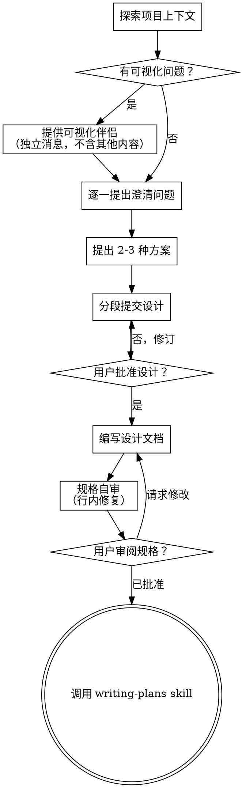

# Brainstorming Ideas Into Designs

通过自然的协作对话，帮助将想法转化为完整的设计方案和规格说明。

首先了解当前项目上下文，然后逐一提问题来细化想法。在清楚要构建什么之后，展示设计方案并获取用户批准。

<HARD-GATE>
在提交设计方案并获得用户批准之前，不得调用任何实现 skill、编写任何代码、搭建任何项目或执行任何实现操作。无论项目看起来多么简单，这适用于所有项目。
</HARD-GATE>

## 反模式："这太简单了，不需要设计"

每个项目都要经过这个流程。待办事项列表、单函数工具、配置更改——都包括在内。"简单"项目正是未经审视的假设导致最多浪费工作的地方。设计方案可以很简短（对于真正简单的项目只需几句话），但必须提交并获得批准。

## 清单

必须为以下每一项创建任务并按顺序完成：

1. **探索项目上下文** —— 检查文件、文档、最近的提交
2. **提供可视化伴侣**（如果主题会涉及可视化问题）—— 这是独立的消息，不与其他澄清问题合并。见下方的"可视化伴侣"章节。
3. **逐一提出澄清问题** —— 每次一个，理解目的/约束/成功标准
4. **提出 2-3 种方案** —— 包含权衡分析和你的推荐
5. **提交设计方案** —— 按复杂度分段展示，每段之后获取用户批准
6. **编写设计文档** —— 保存到 `docs/superpowers/specs/YYYY-MM-DD-<topic>-design.md` 并提交
7. **规格自审** —— 快速行内检查占位符、矛盾、歧义、范围（见下方）
8. **用户审阅书面规格** —— 在继续之前请用户审阅规格文件
9. **过渡到实现** —— 调用 writing-plans skill 创建实现计划

## 流程

**终端状态是调用 writing-plans。** 不得调用 frontend-design、mcp-builder 或任何其他实现 skill。头脑风暴之后唯一要调用的 skill 是 writing-plans。

## 流程详解

**理解想法：**

- 首先检查当前项目状态（文件、文档、最近的提交）
- 在提详细问题之前，评估范围：如果请求描述了多个独立的子系统（例如，"构建一个包含聊天、文件存储、计费和分析的平台"），立即指出这一点。不要花时间细化一个需要先拆解的项目。
- 如果项目规模太大，不适合单一规格，帮助用户拆解成子项目：哪些是独立的部分，它们之间如何关联，应该按什么顺序构建？然后按正常的设计流程对第一个子项目进行头脑风暴。每个子项目有独立的 规格 → 计划 → 实现 周期。
- 对于范围适当的项目，逐一提问题来细化想法
- 尽可能使用选择题形式，但开放式问题也可以
- 每条消息只问一个问题——如果某个主题需要更多探索，拆成多个问题
- 重点关注理解：目的、约束、成功标准

**探索方案：**

- 提出 2-3 种不同的方案并说明权衡
- 以对话方式呈现选项，附上你的推荐和理由
- 先介绍你推荐的方案并解释原因

**提交设计方案：**

- 一旦你认为理解了要构建什么，就提交设计方案
- 每段按复杂度缩放：简单的部分几句话，复杂的部分最多 200-300 字
- 每段之后询问是否妥当
- 覆盖：架构、组件、数据流、错误处理、测试
- 如果某些地方说不通，随时准备返回澄清

**以隔离和清晰性为目标设计：**

- 将系统拆解为较小的单元，每个单元有清晰的单一目的，通过定义良好的接口通信，可以独立理解和测试
- 对于每个单元，你应该能回答：它做什么，如何使用它，它依赖什么？
- 不看内部实现就能理解一个单元做什么吗？能在不破坏消费者的情况下更改内部实现吗？如果不能，边界需要重新设计。
- 更小、边界清晰的单元也更容易让你处理——你能更好地围绕可一次性放入上下文的代码进行推理，当文件聚焦时你的编辑也更可靠。当文件变大时，这通常是它承担了太多职责的信号。

**在已有代码库中工作：**

- 在提出变更之前探索当前结构。遵循已有模式。
- 当已有代码存在影响本次工作的问题（例如，文件变得过大、边界不清晰、职责纠缠），在设计方案中包含有针对性的改进——就像一个优秀的开发者在改进正使用的代码。
- 不要提出无关的重构。专注于服务于当前目标的内容。

## 设计完成后

**文档化：**

- 将经过验证的设计方案（规格）写入 `docs/superpowers/specs/YYYY-MM-DD-<topic>-design.md`
  - （用户对规格位置的偏好可以覆盖此默认值）
- 如果有 elements-of-style:writing-clearly-and-concisely skill，使用它
- 将设计文档提交到 git

**规格自审：**
写完规格文档后，用新的眼光审视它：

1. **占位符扫描：** 有没有 "TBD"、"TODO"、不完整的段落或模糊的需求？修复它们。
2. **内部一致性：** 有没有任何章节相互矛盾？架构是否与功能描述匹配？
3. **范围检查：** 这是否足够聚焦于一个单独的实现计划？还是需要分解？
4. **歧义检查：** 是否有需求可以有两种不同的解读方式？如果有，选择一种并明确写出来。

内联修复所有问题。不需要重新审阅——修好就继续。

**用户审阅关卡：**
在规格审阅循环通过后，在继续之前请用户审阅书面规格：

> "规格已编写并提交到 `<path>`。请在开始编写实现计划之前审阅它，如果有任何修改意见请告诉我。"

等待用户回复。如果请求修改，进行修改并重新运行规格审阅循环。只有用户批准后才继续。

**实现：**

- 调用 writing-plans skill 创建详细的实现计划
- 不得调用任何其他 skill。writing-plans 是下一步。

## 关键原则

- **一次一个问题** —— 不要用多个问题淹没用户
- **优先选择题** —— 尽可能让用户更容易回答
- **严格执行 YAGNI** —— 从所有设计中移除不必要的功能
- **探索替代方案** —— 在确定之前总是提出 2-3 种方案
- **增量验证** —— 提交设计方案，获得批准再继续
- **保持灵活** —— 当某些地方说不通时，返回澄清

## 可视化伴侣

在头脑风暴过程中，一个基于浏览器的伴侣工具用于展示原型、图表和可视化选项。作为一个工具而非模式存在。接受伴侣意味着它在有利于可视化处理的问题上可用；这并不意味着每个问题都要通过浏览器。

**提供伴侣：** 当你预计接下来的问题会涉及可视化内容（原型、布局、图表）时，作为单独的同意请求发送一次：

> "我们目前工作的一些内容，如果能通过网页浏览器展示可能会更容易解释。我可以在过程中展示原型、图示、对比图和其他可视化内容。这个功能较新，可能会消耗较多 token。想试试吗？（需要打开本地 URL）"

**这个提议必须是独立的消息。** 不要与澄清问题、上下文总结或其他内容合并。该消息应该仅包含上述提议，不包含其他内容。等待用户回复再继续。如果用户拒绝，继续纯文本的头脑风暴。

**每个问题单独决定：** 即使用户已接受，每个问题都要独立决定使用浏览器还是终端。判断标准：**用户看比读更能理解吗？**

- **使用浏览器** 处理真正可视化的内容——原型、线框图、布局对比、架构图、并排视觉设计
- **使用终端** 处理文本类内容——需求问题、概念选择、权衡列表、A/B/C/D 文本选项、范围决策

关于 UI 主题的问题并不自动等于可视化问题。"在这个上下文中，个性化是什么意思？" 是概念问题——用终端。"哪种向导布局更好？" 是可视化问题——用浏览器。

如果用户同意使用伴侣，在继续之前阅读详细指南：
`skills/0004_superpowers/001_brainstorming/visual-companion.md`
