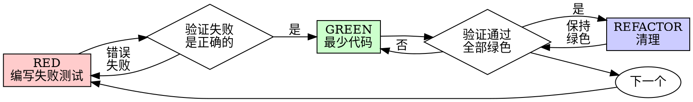

# Test-Driven Development (TDD)

## 概览

先写测试。看它失败。写最少代码让它通过。

**核心原则:** 如果你没看到测试失败，你就不知道它是否真正测试了正确的东西。

**违反规则的字母就是违反规则的精神。**

## 何时使用

**始终使用:**
- 新功能
- Bug 修复
- 重构
- 行为变更

**例外（征求你的人类伙伴同意）:**
- 一次性原型
- 生成代码
- 配置文件

在想"就这一次跳过 TDD"？停下。那是在找借口。

## 铁律

```
没有先失败的测试，就不得编写产品代码
```

在写测试之前就写了代码？删除它。重新开始。

**毫无例外:**
- 不要保留作为"参考"
- 不要在写测试时"修改"它
- 不要去看它
- 删除就是删除

从测试重新实现。句号。

## Red-Green-Refactor



### RED - 编写失败测试

写一个最简的测试，表明应该发生什么。

**要求:**
- 一个行为
- 清晰的命名
- 真实代码（除非无法避免，否则不使用 mock）

### 验证 RED - 观察它失败

**强制执行。绝不能跳过。**

确认:
- 测试失败（不是报错）
- 失败信息符合预期
- 失败是因为功能缺失（不是拼写错误）

**测试通过了？** 你测试的是已有行为。修正测试。

**测试报错了？** 修复错误，重新运行直到它正确失败。

### GREEN - 最少代码

写最简代码让测试通过。

不要添加功能、重构其他代码、或做超出测试范围的"改进"。

### 验证 GREEN - 观察它通过

**强制执行。**

确认:
- 测试通过
- 其他测试仍然通过
- 输出干净（没有错误、警告）

**测试失败？** 修正代码，不是修正测试。

**其他测试失败？** 立即修正。

### REFACTOR - 清理

仅在绿色之后:
- 消除重复
- 改进命名
- 提取辅助函数

保持测试绿色。不要添加行为。

### 重复

下一个失败测试，对应下一个功能。

## 好的测试

| 质量维度 | 好 | 坏 |
|---------|------|-----|
| **最小化** | 一件事。名称里有"和"？拆开。 | `test('validates email and domain and whitespace')` |
| **清晰** | 名称描述行为 | `test('test1')` |
| **展示意图** | 展示期望的 API | 模糊代码应该做什么 |

## 为什么顺序很重要

**"我写完后再写测试来验证它能用"**

代码之后写的测试会立即通过。立即通过什么都证明不了:
- 可能测试错误的东西
- 可能测试实现，而非行为
- 可能遗漏你忘记的边缘情况
- 你从未看到它捕获 bug

测试先行迫使你看到测试失败，证明它真的测试到了东西。

**"我已经手动测试了所有边缘情况"**

手动测试是即兴的。你以为你测试了一切，但:
- 没有你测试了什么的记录
- 代码变更时无法重新运行
- 压力下容易忘记情况

**"删掉 X 小时的工作太浪费了"**

沉没成本谬误。时间已经花掉了。你现在的选择是:
- 删除并用 TDD 重写（再多 X 小时，高信心）
- 保留并事后加测试（30 分钟，低信心，可能有 bug）

**"TDD 是教条主义，务实意味着灵活变通"**

TDD 就是务实的:
- 提交前发现 bug（比事后调试更快）
- 防止回归（测试立即捕获破坏）
- 记录行为（测试展示如何使用代码）
- 支持重构（自由修改，测试捕获破坏）

**"事后测试达到同样目标——这是精神不是仪式"**

不。事后测试回答"这做了什么？" 先写测试回答"这应该做什么？"

## 常见借口

| 借口 | 现实 |
|--------|---------|
| "太简单不需要测试" | 简单代码也会坏。测试只要 30 秒。 |
| "我之后再测试" | 立即通过的测试什么都证明不了。 |
| "事后测试达到同样目标" | 事后测试 = "这做了什么？" 先写测试 = "这应该做什么？" |
| "已经手动测试过了" | 即兴 ≠ 系统化。没有记录，无法重新运行。 |
| "删掉 X 小时太浪费了" | 沉没成本谬误。保留未验证代码就是技术债务。 |
| "保留作为参考，先写测试" | 你会去改它。那就是事后测试。删除就是删除。 |
| "需要先探索一下" | 可以。丢弃探索成果，用 TDD 开始。 |
| "测试难 = 设计不清晰" | 倾听测试。难测试 = 难使用。 |
| "TDD 会拖慢我" | TDD 比调试更快。务实 = 测试先行。 |
| "现有代码没有测试" | 你在改进它。为现有代码加测试。 |

## 红旗 - 停下并重新开始

- 测试之前写了代码
- 实现之后写测试
- 测试立即通过
- 无法解释测试为什么失败
- 测试"稍后"添加
- 找借口说"就这一次"
- "我已经手动测试过了"
- "事后测试达到同样目的"
- "这是关于精神不是仪式"
- "保留作为参考"或"修改现有代码"
- "已经花了 X 小时，删除太浪费了"
- "TDD 是教条，我很务实"
- "这次不同是因为..."

**以上所有都意味着: 删除代码。用 TDD 重新开始。**

## 验证检查清单

在标记工作完成之前:

- [ ] 每个新函数/方法都有测试
- [ ] 每个测试在实现前都观察到失败
- [ ] 每个测试因预期原因失败（功能缺失，而非拼写错误）
- [ ] 写了最少代码让每个测试通过
- [ ] 所有测试通过
- [ ] 输出干净（没有错误、警告）
- [ ] 测试使用真实代码（mock 仅用于无法避免的情况）
- [ ] 覆盖了边缘情况和错误情况

无法勾选所有项？你跳过了 TDD。重新开始。

## 当卡住时

| 问题 | 解决方案 |
|---------|----------|
| 不知道如何测试 | 写你想要的 API。先写断言。询问你的人类伙伴。 |
| 测试太复杂 | 设计太复杂。简化接口。 |
| 必须 mock 所有东西 | 代码耦合太紧。使用依赖注入。 |
| 测试准备代码太多 | 提取辅助函数。仍然复杂？简化设计。 |

## 调试集成

发现 bug？写一个失败测试复现它。遵循 TDD 循环。测试证明修复并防止回归。

永远不要在没有测试的情况下修复 bug。

## 测试反模式

当添加 mock 或测试工具时，阅读 `testing-anti-patterns.md` 以避免常见陷阱。

## 最终规则

```
产品代码 → 测试存在且先失败过
否则 → 不是 TDD
```

未经你的人类伙伴许可，毫无例外。
